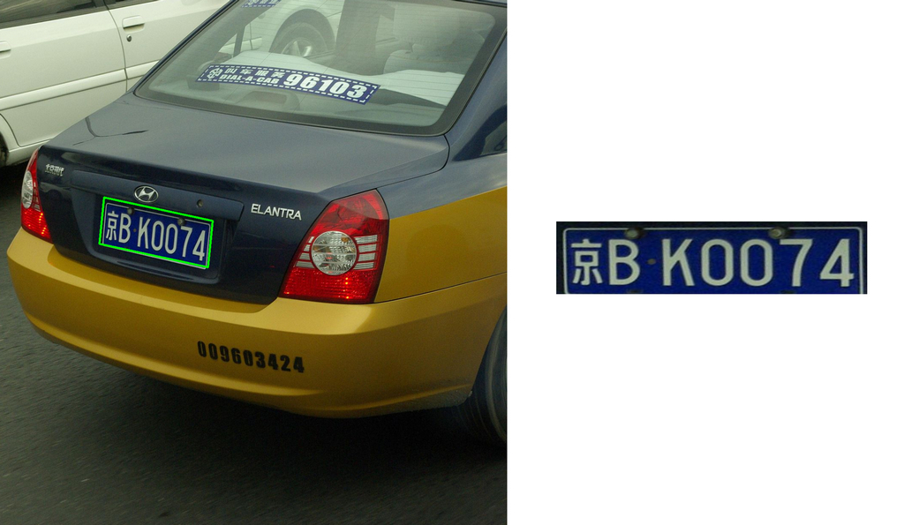

[Read the series from Medium](https://medium.com/@quangnhatnguyenle/detect-and-recognize-vehicles-license-plate-with-machine-learning-and-python-part-1-detection-795fda47e922)

# Detect and Recognize Vehicle’s License Plate with Machine Learning and Python 

- [x] _Currently up-to-date with Part 1_

## Credit
[sergiomsilva](https://github.com/sergiomsilva/alpr-unconstrained)
