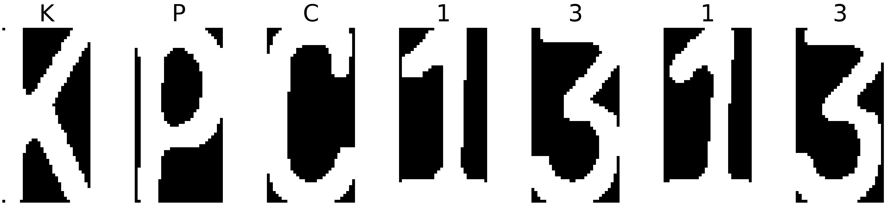

## Update
__(29/7/2020)__
- Rename `utils.py` to  `local_utils.py` to avoid conflicit with default Python library `utils.py`.
- Replace error `index out of range` to `No License plate is founded!`.
- In case error `No License Plate is founded!` popped up, try to adjust Dmin from `get_plate()` function. Keep in mind that larger Dmin means more highly plate's information is lost.

## [Read the series on Medium](https://medium.com/@quangnhatnguyenle/detect-and-recognize-vehicles-license-plate-with-machine-learning-and-python-part-1-detection-795fda47e922)
- Part 1: [Detection License Plate with Wpod-Net](https://medium.com/@quangnhatnguyenle/detect-and-recognize-vehicles-license-plate-with-machine-learning-and-python-part-1-detection-795fda47e922)
- Part 2: [Plate character segmentation with OpenCV](https://medium.com/@quangnhatnguyenle/detect-and-recognize-vehicles-license-plate-with-machine-learning-and-python-part-2-plate-de644de9849f)
- Part 3: [Recognize plate license characters with OpenCV and Deep Learning](https://medium.com/@quangnhatnguyenle/detect-and-recognize-vehicles-license-plate-with-machine-learning-and-python-part-3-recognize-be2eca1a9f12)

## Tools and Libraries
- Python==3.6
- Keras==2.3.1
- Tensorflow==1.14.0
- Numpy==1.17.4
- Matplotlib==3.2.1
- OpenCV==4.1.0
- sklearn==0.21.3

# Detect and Recognize Vehicle’s License Plate with Machine Learning and Python 

### [Part 1: Detection License Plate with Wpod-Net](https://medium.com/@quangnhatnguyenle/detect-and-recognize-vehicles-license-plate-with-machine-learning-and-python-part-1-detection-795fda47e922)

 

### [Part 2: Plate character segmentation with OpenCV](https://medium.com/@quangnhatnguyenle/detect-and-recognize-vehicles-license-plate-with-machine-learning-and-python-part-2-plate-de644de9849f)

 

### [Part 3: Recognize plate license characters with OpenCV and Deep Learning](https://medium.com/@quangnhatnguyenle/detect-and-recognize-vehicles-license-plate-with-machine-learning-and-python-part-3-recognize-be2eca1a9f12)

 

## Credit
[sergiomsilva](https://github.com/sergiomsilva/alpr-unconstrained)
